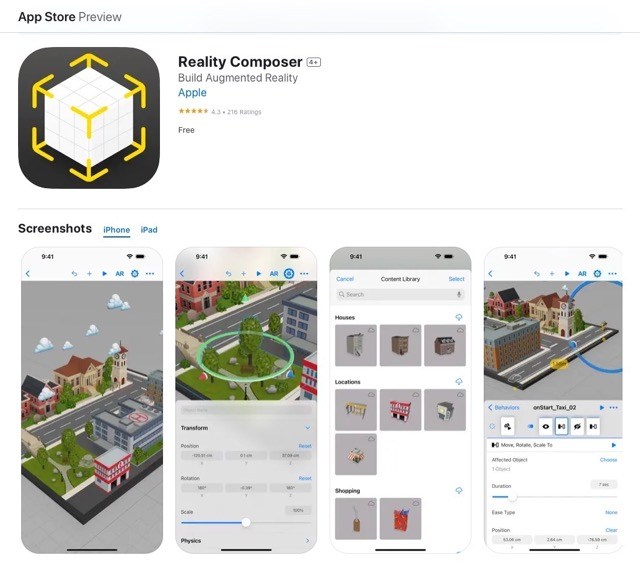
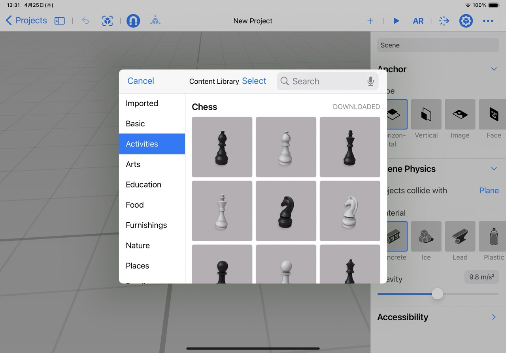
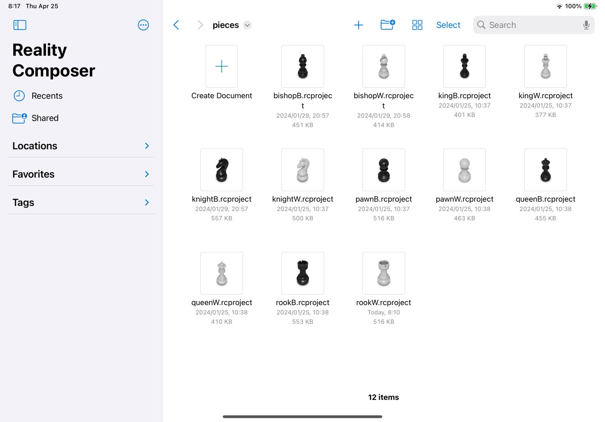
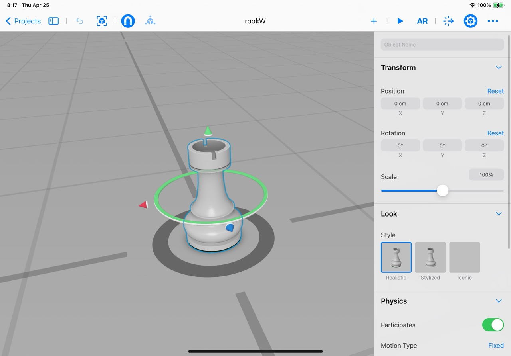
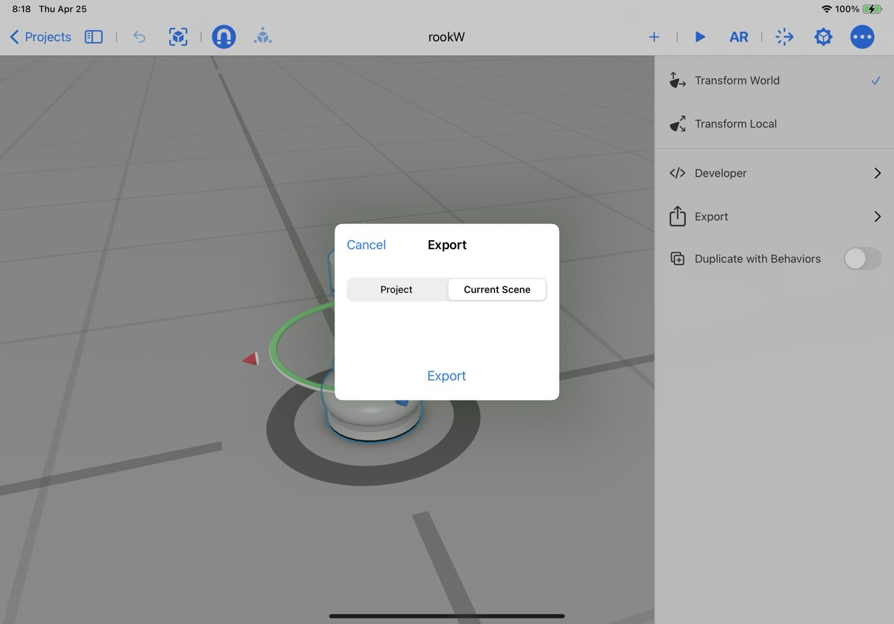
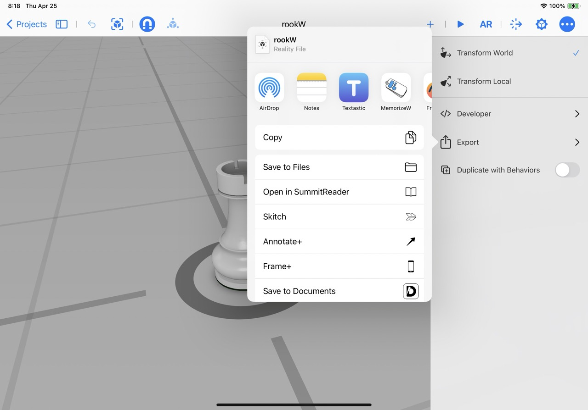

# About piece assets for PersonaChess

## Sourced the 3D model data for the piece from Reality Composer app.
The 3D model of the piece used in this app is a built-in asset of the Reality Composer app.

## What's "Reality Composer"
> Reality Composer is a tool developed by Apple that allows users to create and experience augmented reality (AR) scenarios. It enables users to build interactive AR experiences without needing extensive programming knowledge. You can use it to place and manipulate virtual objects in a real-world view, integrate animations, and set up triggers that respond to user actions, like touching an object or moving the device.

> Reality Composer is particularly useful for designers, educators, and developers who want to create immersive AR projects. It works seamlessly with Apple's ARKit framework, enhancing the capabilities of AR applications on iOS devices. The tool provides a user-friendly interface and a variety of assets and templates to help users get started with AR content creation.

…, according to ChatGPT.

### "Reality Composer" App Store link
https://apps.apple.com/app/id1462358802

## Screenshot log

